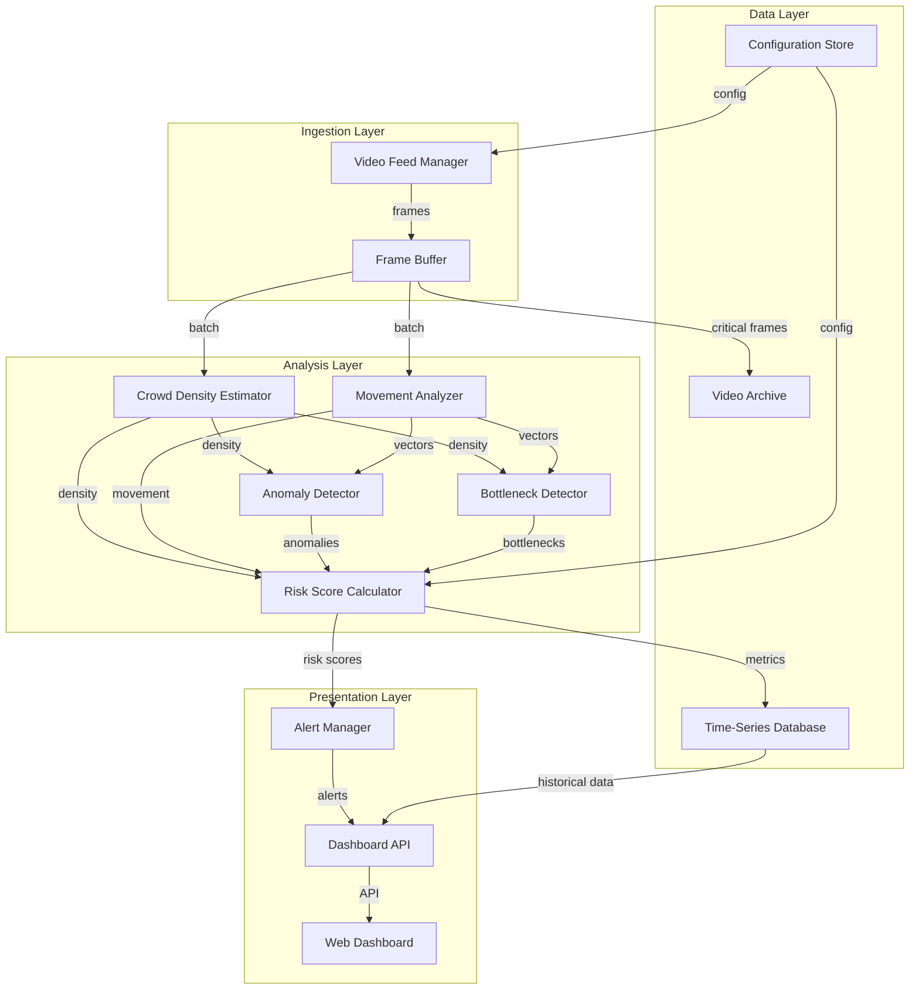

# Design Document: Stampede Early Warning System

## Overview

The Stampede Early Warning System is a distributed, real-time computer vision platform that processes live CCTV feeds to predict and prevent stampede incidents at large public gatherings. The system employs deep learning models for crowd analysis, a risk assessment engine for threat prediction, and a real-time dashboard for authority monitoring.

The architecture follows a microservices pattern with three primary layers:
1. **Ingestion Layer**: Manages CCTV feed connections and frame extraction
2. **Analysis Layer**: Performs AI-based crowd analysis and risk calculation
3. **Presentation Layer**: Provides dashboard visualization and alert delivery

The system is designed to integrate with existing CCTV infrastructure, scale horizontally to support large events, and operate with sub-5-second latency from video capture to alert generation.

## Architecture

### System Components



### Deployment Architecture

The system deploys as containerized services orchestrated by Kubernetes:
- **Video Feed Manager**: Stateless pods (auto-scaling based on camera count)
- **Analysis Services**: GPU-enabled pods for ML inference
- **Dashboard API**: Stateless pods behind load balancer
- **Databases**: Managed services (TimescaleDB for time-series, Redis for configuration)

### Data Flow

1. Video Feed Manager establishes connections to CCTV cameras via RTSP/HTTP/RTMP
2. Frames are extracted at 10 FPS and pushed to Frame Buffer (Redis queue)
3. Analysis services consume frames in batches for parallel processing
4. Crowd Density Estimator runs object detection model to count people and estimate density
5. Movement Analyzer tracks optical flow to calculate movement vectors
6. Anomaly Detector compares current patterns against learned baselines
7. Bottleneck Detector identifies congestion points using density gradients
8. Risk Score Calculator aggregates all metrics into unified risk score
9. Alert Manager evaluates risk scores against thresholds and triggers notifications
10. Dashboard API serves real-time data to web interface
11. Time-Series Database stores all metrics for historical analysis

## Components and Interfaces

### Video Feed Manager

**Responsibility**: Establish and maintain connections to CCTV cameras, extract frames, and handle reconnection logic.

**Interface**:
```
class VideoFeedManager:
    def connect_camera(camera_id: str, url: str, protocol: str) -> bool
    def disconnect_camera(camera_id: str) -> bool
    def get_frame(camera_id: str) -> Frame
    def get_connection_status(camera_id: str) -> ConnectionStatus
    def list_active_cameras() -> List[CameraInfo]
```

**Key Operations**:
- `connect_camera`: Validates URL, establishes connection using appropriate protocol handler (RTSP/HTTP/RTMP), starts frame extraction thread
- `disconnect_camera`: Gracefully closes connection and cleans up resources
- `get_frame`: Returns latest frame from camera buffer
- Automatic reconnection: On connection failure, logs error and retries every 30 seconds

**Configuration**:
- Target frame rate: 10 FPS per camera
- Frame buffer size: 30 frames per camera (3 seconds)
- Reconnection interval: 30 seconds
- Maximum concurrent cameras: 50

### Frame Buffer

**Responsibility**: Queue frames for processing and enable parallel consumption by analysis services.

**Interface**:
```
class FrameBuffer:
    def push_frame(camera_id: str, frame: Frame, timestamp: float) -> bool
    def pop_batch(batch_size: int) -> List[FrameData]
    def get_queue_depth() -> int
```

**Implementation**: Redis-backed queue with separate queues per camera to prevent head-of-line blocking.

### Crowd Density Estimator

**Responsibility**: Estimate number of people per square meter in each monitored zone.

**Interface**:
```
class CrowdDensityEstimator:
    def estimate_density(frame: Frame, zones: List[Zone]) -> Dict[str, float]
    def calibrate_zone(zone_id: str, ground_truth_area: float) -> bool
```

**Algorithm**:
1. Run YOLOv8 object detection model to detect people in frame
2. Apply perspective transformation to correct for camera angle
3. Map detected persons to defined monitoring zones
4. Calculate density = person_count / zone_area_sqm
5. Apply temporal smoothing (moving average over 3 seconds) to reduce noise

**Model**: YOLOv8-large pre-trained on COCO dataset, fine-tuned on Indian crowd datasets

**Performance**: 
- Inference time: <100ms per frame on GPU
- Accuracy: ±15% of ground truth density
- Minimum accuracy in low light: 80%

### Movement Analyzer

**Responsibility**: Calculate crowd movement speed and direction for each zone.

**Interface**:
```
class MovementAnalyzer:
    def analyze_movement(current_frame: Frame, previous_frame: Frame, zones: List[Zone]) -> Dict[str, MovementVector]
    def detect_acceleration(zone_id: str, window_seconds: int) -> bool
    def detect_bidirectional_flow(zone_id: str) -> bool
```

**Algorithm**:
1. Compute dense optical flow using Farneback algorithm between consecutive frames
2. Segment flow vectors by monitoring zone
3. Calculate average flow magnitude (speed) and direction per zone
4. Track speed changes over 5-second sliding window to detect acceleration
5. Analyze flow direction variance to identify bidirectional movement

**Thresholds**:
- Abnormal speed: >1.5 m/s
- Sudden acceleration: >50% speed increase within 5 seconds
- Bidirectional flow: Opposing vectors with >90° difference

### Anomaly Detector

**Responsibility**: Identify unusual crowd behaviors that deviate from normal patterns.

**Interface**:
```
class AnomalyDetector:
    def learn_baseline(frames: List[Frame], duration_minutes: int) -> BaselineModel
    def detect_anomaly(current_metrics: Metrics, baseline: BaselineModel) -> AnomalyReport
    def detect_panic_movement(movement_vectors: List[MovementVector]) -> bool
    def detect_falls(frame: Frame, previous_frame: Frame) -> int
```

**Algorithm**:
1. **Baseline Learning** (first 15 minutes):
   - Collect density and movement statistics
   - Build statistical model (mean, std dev) for each zone
   - Store as baseline for comparison

2. **Anomaly Detection**:
   - Calculate z-score for current metrics vs baseline
   - Flag anomaly if z-score > 3.0 (3 standard deviations)
   - Use Isolation Forest model for multivariate anomaly detection

3. **Panic Detection**:
   - Identify sudden directional changes (>90° within 2 seconds)
   - Detect simultaneous speed increases across multiple zones
   - Flag if both conditions occur

4. **Fall Detection**:
   - Track person bounding boxes frame-to-frame
   - Detect rapid vertical position changes
   - Count falls when >3 people show fall pattern within 5 seconds

**Model**: Isolation Forest trained on normal crowd behavior patterns

### Bottleneck Detector

**Responsibility**: Identify congestion points where crowd flow is restricted.

**Interface**:
```
class BottleneckDetector:
    def detect_bottlenecks(density_map: Dict[str, float]) -> List[Bottleneck]
    def calculate_severity(bottleneck: Bottleneck, duration_seconds: int) -> float
    def identify_exit_points(venue_map: VenueMap) -> List[Zone]
```

**Algorithm**:
1. Calculate density gradient between adjacent zones
2. Flag zone as bottleneck if density is ≥50% higher than neighbors
3. Track bottleneck duration using persistent state
4. Calculate severity score:
   ```
   severity = (density_ratio - 1.0) * log(duration_seconds + 1) * exit_point_multiplier
   ```
   where exit_point_multiplier = 2.0 for zones near exits, 1.0 otherwise

5. Escalate priority if bottleneck persists >30 seconds

**Detection Latency**: <10 seconds from bottleneck formation

### Risk Score Calculator

**Responsibility**: Aggregate all analysis metrics into a unified risk score (0-100).

**Interface**:
```
class RiskScoreCalculator:
    def calculate_risk(zone_id: str, metrics: ZoneMetrics) -> float
    def set_weights(density_weight: float, movement_weight: float, anomaly_weight: float, bottleneck_weight: float) -> bool
    def classify_risk_level(risk_score: float) -> RiskLevel
```

**Algorithm**:
```
risk_score = (
    density_component * 0.35 +
    movement_component * 0.25 +
    anomaly_component * 0.25 +
    bottleneck_component * 0.15
) * 100

where:
    density_component = min(1.0, current_density / max_safe_density)
    movement_component = min(1.0, movement_speed / 2.0)  # normalized to 2 m/s max
    anomaly_component = 1.0 if anomaly detected else 0.0
    bottleneck_component = min(1.0, bottleneck_severity / 10.0)
```

**Risk Levels**:
- Low: 0-50
- Medium: 51-70
- High: 71-85
- Critical: 86-100

**Update Frequency**: Every 2 seconds per zone

### Alert Manager

**Responsibility**: Generate and deliver alerts when risk thresholds are exceeded.

**Interface**:
```
class AlertManager:
    def configure_threshold(risk_level: RiskLevel, threshold: float) -> bool
    def evaluate_alerts(risk_scores: Dict[str, float]) -> List[Alert]
    def send_alert(alert: Alert, channels: List[NotificationChannel]) -> bool
    def prioritize_alerts(alerts: List[Alert]) -> List[Alert]
```

**Alert Generation Logic**:
1. Compare each zone's risk score against configured threshold
2. If risk_score > threshold, create alert with:
   - Zone ID and location
   - Current risk score
   - Contributing factors (density, movement, anomalies, bottlenecks)
   - Timestamp
   - Severity level

3. Prioritize multiple simultaneous alerts by risk score (highest first)
4. Deliver via configured channels (SMS, email, push notification)
5. Implement rate limiting: Maximum 1 alert per zone per minute to prevent spam

**Delivery SLA**: <2 seconds from threshold breach to notification sent

**Notification Channels**:
- SMS: Twilio API integration
- Email: SMTP server
- Push: Firebase Cloud Messaging
- Webhook: HTTP POST to external systems

### Dashboard API

**Responsibility**: Provide REST API for dashboard frontend and external integrations.

**Interface**:
```
REST API Endpoints:

GET /api/v1/zones
    Returns: List of all monitoring zones with current metrics

GET /api/v1/zones/{zone_id}/density
    Returns: Current crowd density for specified zone

GET /api/v1/zones/{zone_id}/risk
    Returns: Current risk score and level for specified zone

GET /api/v1/alerts/active
    Returns: List of currently active alerts

GET /api/v1/heatmap
    Returns: Density heatmap data for all zones

GET /api/v1/historical/density?zone_id={id}&start={ts}&end={ts}
    Returns: Historical density data for time range

GET /api/v1/historical/alerts?start={ts}&end={ts}
    Returns: Historical alert data for time range

POST /api/v1/export/report
    Body: {start_time, end_time, format}
    Returns: Generated report in CSV or JSON format

WebSocket /api/v1/stream/realtime
    Streams: Real-time updates for density, risk scores, and alerts
```

**Authentication**: JWT-based authentication with role-based access control

**Rate Limiting**: 100 requests per minute per user

### Web Dashboard

**Responsibility**: Provide visual interface for monitoring crowd conditions.

**Interface Components**:

1. **Live Heatmap View**:
   - Color-coded density visualization (green → yellow → red)
   - Updates every 3 seconds
   - Overlays movement vector arrows
   - Highlights bottleneck zones with pulsing border

2. **Zone Status Panel**:
   - Grid view of all zones
   - Shows current density, risk score, and status
   - Color-coded by risk level

3. **Alert Feed**:
   - Real-time list of active alerts
   - Timestamp, zone, severity, and description
   - Click to focus on zone in heatmap

4. **Historical Charts**:
   - Time-series graphs for density and risk trends
   - Configurable time ranges (1 hour, 6 hours, 24 hours)
   - Export functionality

5. **Camera Feed Grid**:
   - Live video thumbnails from selected cameras
   - Click to expand to full view
   - Overlay with detected person bounding boxes

**Technology Stack**: React frontend, WebSocket for real-time updates, Mapbox for venue visualization

## Data Models

### Frame
```
class Frame:
    camera_id: str
    timestamp: float
    image_data: bytes  # JPEG encoded
    width: int
    height: int
    metadata: Dict[str, Any]
```

### Zone
```
class Zone:
    zone_id: str
    name: str
    polygon: List[Point]  # boundary coordinates
    area_sqm: float
    max_safe_density: float
    is_exit_point: bool
    camera_ids: List[str]
```

### MovementVector
```
class MovementVector:
    zone_id: str
    timestamp: float
    speed_mps: float  # meters per second
    direction_degrees: float  # 0-360
    confidence: float  # 0.0-1.0
```

### Bottleneck
```
class Bottleneck:
    zone_id: str
    detected_at: float
    density_ratio: float  # vs adjacent zones
    duration_seconds: int
    severity: float
```

### AnomalyReport
```
class AnomalyReport:
    zone_id: str
    timestamp: float
    anomaly_type: str  # "panic", "falls", "statistical"
    confidence: float
    description: str
    contributing_metrics: Dict[str, float]
```

### Alert
```
class Alert:
    alert_id: str
    zone_id: str
    timestamp: float
    risk_score: float
    severity: RiskLevel
    contributing_factors: List[str]
    status: str  # "active", "acknowledged", "resolved"
    notified_users: List[str]
```

### ZoneMetrics
```
class ZoneMetrics:
    zone_id: str
    timestamp: float
    crowd_density: float
    person_count: int
    movement_vector: MovementVector
    risk_score: float
    has_anomaly: bool
    has_bottleneck: bool
```

### VenueConfiguration
```
class VenueConfiguration:
    venue_id: str
    name: str
    zones: List[Zone]
    cameras: List[CameraInfo]
    risk_thresholds: Dict[RiskLevel, float]
    alert_channels: List[NotificationChannel]
```


## Correctness Properties

A property is a characteristic or behavior that should hold true across all valid executions of a system—essentially, a formal statement about what the system should do. Properties serve as the bridge between human-readable specifications and machine-verifiable correctness guarantees.

### Video Feed Management Properties

**Property 1: Connection establishment for valid feeds**
*For any* valid CCTV feed URL and supported protocol (RTSP, HTTP, RTMP), the Video Feed Manager should successfully establish a connection and begin receiving frames.
**Validates: Requirements 1.1, 1.2**

**Property 2: Reconnection on failure**
*For any* CCTV feed that experiences connection failure, the system should log the error and attempt reconnection at 30-second intervals until successful.
**Validates: Requirements 1.3**

### Crowd Density Properties

**Property 3: Density estimation completeness**
*For any* video frame and set of monitoring zones, the Crowd Density Estimator should produce a density value for each zone.
**Validates: Requirements 2.1**

**Property 4: High-density flagging**
*For any* zone with crowd density exceeding 4 people per square meter, the system should flag that zone as high-density.
**Validates: Requirements 2.4**

### Movement Analysis Properties

**Property 5: Movement vector calculation**
*For any* pair of consecutive video frames and set of monitoring zones, the Movement Analyzer should calculate a movement vector for each zone.
**Validates: Requirements 3.1**

**Property 6: Acceleration detection**
*For any* sequence of movement measurements where speed increases by more than 50% within a 5-second window, the system should detect and flag sudden acceleration.
**Validates: Requirements 3.2**

**Property 7: Abnormal speed flagging**
*For any* zone where crowd movement speed exceeds 1.5 meters per second, the system should flag the movement as abnormal.
**Validates: Requirements 3.3**

**Property 8: Bidirectional flow detection**
*For any* zone containing movement vectors with opposing directions (>90° difference), the system should identify and flag bidirectional flow.
**Validates: Requirements 3.4**

**Property 9: Erratic pattern detection**
*For any* sequence of movement vectors showing rapid directional changes (>90° within 2 seconds), the system should flag the pattern as erratic.
**Validates: Requirements 3.5**

### Bottleneck Detection Properties

**Property 10: Bottleneck identification**
*For any* zone with crowd density at least 50% higher than all adjacent zones, the system should classify that zone as a bottleneck.
**Validates: Requirements 4.1**

**Property 11: Bottleneck priority escalation**
*For any* bottleneck that persists for more than 30 seconds, the system should escalate its priority level.
**Validates: Requirements 4.3**

**Property 12: Severity calculation**
*For any* bottleneck, the calculated severity should be a function of density differential and duration, following the formula: severity = (density_ratio - 1.0) * log(duration + 1) * exit_multiplier.
**Validates: Requirements 4.4**

### Anomaly Detection Properties

**Property 13: Baseline-based anomaly detection**
*For any* crowd metrics that deviate from the learned baseline by more than 3 standard deviations, the system should classify the behavior as an anomaly.
**Validates: Requirements 5.1**

**Property 14: Panic movement detection**
*For any* movement pattern showing both sudden directional changes (>90° within 2 seconds) and simultaneous speed increases across multiple zones, the system should detect and flag panic-like movement.
**Validates: Requirements 5.2**

**Property 15: Fall detection and critical alert**
*For any* zone where 3 or more people show fall patterns within 5 seconds, the system should trigger a critical anomaly alert.
**Validates: Requirements 5.3**

**Property 16: Baseline learning**
*For any* 15-minute sequence of initial monitoring data, the system should generate a baseline model containing statistical parameters (mean, standard deviation) for each zone.
**Validates: Requirements 5.5**

### Risk Score Properties

**Property 17: Risk score bounds**
*For any* zone and set of metrics, the calculated risk score should be a value between 0 and 100 inclusive.
**Validates: Requirements 6.1**

**Property 18: Risk score composition**
*For any* zone, the risk score calculation should incorporate all four factors: crowd density, movement speed, anomaly presence, and bottleneck severity, with the specified weights (0.35, 0.25, 0.25, 0.15).
**Validates: Requirements 6.2**

**Property 19: Risk level classification**
*For any* risk score value, the system should classify it correctly: low (0-50), medium (51-70), high (71-85), or critical (86-100).
**Validates: Requirements 6.4, 6.5**

### Alert Management Properties

**Property 20: Threshold-based alert generation**
*For any* zone with risk score exceeding the configured threshold, the system should generate an alert for that zone.
**Validates: Requirements 7.1**

**Property 21: Alert completeness**
*For any* generated alert, it should include all required fields: zone location, risk score, contributing factors, timestamp, and severity level.
**Validates: Requirements 7.3**

**Property 22: Multi-channel notification**
*For any* generated alert, the system should attempt delivery to all configured notification channels (SMS, email, push, webhook).
**Validates: Requirements 7.4**

**Property 23: Alert prioritization**
*For any* set of simultaneous alerts from multiple zones, the system should order them by risk score in descending order (highest risk first).
**Validates: Requirements 7.5**

### Dashboard and Visualization Properties

**Property 24: Complete zone data availability**
*For any* request for zone data, the API should return crowd density, risk score, and movement vectors for all monitored zones.
**Validates: Requirements 8.1, 8.4, 8.6**

**Property 25: Heatmap color mapping**
*For any* density value, the heatmap color calculation should map low densities to green, medium densities to yellow, and high densities to red using a continuous gradient.
**Validates: Requirements 8.3**

**Property 26: Alert display completeness**
*For any* active alert, the dashboard should display it with timestamp and severity level.
**Validates: Requirements 8.5**

### Historical Data Properties

**Property 27: Data retention**
*For any* crowd density, risk score, or alert record, the system should retain it in storage for at least 90 days from creation.
**Validates: Requirements 9.1**

**Property 28: Time-series data retrieval**
*For any* historical query with start and end timestamps, the system should return time-ordered density and risk data for the specified period.
**Validates: Requirements 9.3**

**Property 29: Export format round-trip**
*For any* valid system data object, exporting to CSV or JSON format and then importing should produce an equivalent object.
**Validates: Requirements 9.4**

**Property 30: Critical alert video archival**
*For any* critical alert (risk score ≥ 86), the system should store video footage from 5 minutes before to 5 minutes after the alert timestamp.
**Validates: Requirements 9.5**

### Configuration Properties

**Property 31: Zone configuration persistence**
*For any* valid zone configuration (boundaries, area, max density, exit point status), saving and then loading the configuration should produce equivalent zone parameters.
**Validates: Requirements 10.1, 10.3, 10.4**

**Property 32: Threshold validation**
*For any* risk threshold value between 50 and 95, the system should accept and store it; for any value outside this range, the system should reject it with an error.
**Validates: Requirements 10.2**

**Property 33: Configuration profile reusability**
*For any* saved venue configuration profile, loading and applying it should restore all zone definitions, camera mappings, and threshold settings.
**Validates: Requirements 10.5**

### System Resilience Properties

**Property 34: Failover redistribution**
*For any* processing node failure, the system should redistribute all camera feeds from the failed node to available nodes.
**Validates: Requirements 11.5**

### Security Properties

**Property 35: Authentication enforcement**
*For any* unauthenticated request to the dashboard API, the system should reject it with a 401 Unauthorized response.
**Validates: Requirements 12.1**

**Property 36: Role-based authorization**
*For any* authenticated user, the system should enforce permissions based on their role (viewer, operator, administrator), allowing only authorized operations.
**Validates: Requirements 12.2**

**Property 37: Password complexity validation**
*For any* password with fewer than 12 characters, the system should reject it; for any password with 12 or more characters meeting complexity requirements, the system should accept it.
**Validates: Requirements 12.3**

**Property 38: Account lockout on failed attempts**
*For any* user account with 3 consecutive failed authentication attempts, the system should lock the account for 15 minutes.
**Validates: Requirements 12.4**

**Property 39: Audit logging completeness**
*For any* access attempt or configuration change, the system should create a log entry containing timestamp, user identity, action type, and outcome.
**Validates: Requirements 12.5**

## Error Handling

### Video Feed Errors

**Connection Failures**:
- Log error with camera ID, URL, and error message
- Trigger reconnection logic (30-second interval)
- Update camera status to "disconnected" in dashboard
- Do not crash or halt processing of other cameras

**Frame Processing Errors**:
- Log error with camera ID and frame timestamp
- Skip corrupted frame and continue with next frame
- If errors persist for >60 seconds, mark camera as "degraded"
- Alert operators if >10% of cameras are degraded

### Analysis Errors

**Model Inference Failures**:
- Log error with model name and input details
- Return last known good value for affected zone
- Mark zone metrics as "stale" after 10 seconds
- Alert operators if inference failures persist

**Invalid Metric Values**:
- Validate all calculated metrics (density ≥ 0, speed ≥ 0, risk score 0-100)
- Clamp out-of-range values to valid bounds
- Log validation errors for investigation
- Do not propagate invalid values to risk calculation

### Alert Delivery Errors

**Notification Channel Failures**:
- Log delivery failure with channel type and error
- Retry failed deliveries up to 3 times with exponential backoff
- Continue attempting delivery to other channels
- Store failed alerts in database for manual review

**Rate Limiting**:
- Implement per-zone rate limit: max 1 alert per minute
- Queue additional alerts for delayed delivery
- Prevent alert spam while ensuring critical alerts are delivered

### Database Errors

**Write Failures**:
- Log error with operation details
- Retry write operations up to 3 times
- If persistent failure, buffer data in memory (max 1000 records)
- Alert operators of database issues

**Query Failures**:
- Return cached data if available
- Return error response to API clients with appropriate HTTP status
- Log error for investigation

### Configuration Errors

**Invalid Configuration**:
- Validate all configuration changes before applying
- Reject invalid configurations with descriptive error messages
- Maintain last known good configuration
- Require administrator approval for critical changes

## Testing Strategy

### Dual Testing Approach

The system requires both unit testing and property-based testing for comprehensive coverage:

**Unit Tests**: Verify specific examples, edge cases, and error conditions
- Focus on concrete scenarios and integration points
- Test error handling paths
- Validate specific input/output examples
- Test boundary conditions

**Property Tests**: Verify universal properties across all inputs
- Test properties hold for randomly generated inputs
- Achieve broad input coverage through randomization
- Validate correctness guarantees
- Each property test runs minimum 100 iterations

Both testing approaches are complementary and necessary. Unit tests catch specific bugs and validate concrete behavior, while property tests verify general correctness across the input space.

### Property-Based Testing Configuration

**Framework Selection**:
- Python: Use Hypothesis library
- TypeScript/JavaScript: Use fast-check library
- Go: Use gopter library

**Test Configuration**:
- Minimum 100 iterations per property test
- Each test must reference its design document property
- Tag format: `Feature: stampede-early-warning, Property {number}: {property_text}`

**Example Property Test Structure** (Python with Hypothesis):
```python
from hypothesis import given, strategies as st

@given(
    density=st.floats(min_value=0.0, max_value=10.0),
    zone_id=st.text(min_size=1)
)
def test_high_density_flagging(density, zone_id):
    """
    Feature: stampede-early-warning
    Property 4: High-density flagging
    
    For any zone with crowd density exceeding 4 people per square meter,
    the system should flag that zone as high-density.
    """
    zone = Zone(zone_id=zone_id, max_safe_density=4.0)
    result = check_high_density(zone, density)
    
    if density > 4.0:
        assert result.is_flagged == True
        assert result.flag_type == "high-density"
    else:
        assert result.is_flagged == False
```

### Unit Testing Strategy

**Component-Level Tests**:
- Video Feed Manager: Test connection establishment, reconnection logic, protocol handling
- Crowd Density Estimator: Test with sample frames, verify zone mapping
- Movement Analyzer: Test optical flow calculation, acceleration detection
- Anomaly Detector: Test baseline learning, anomaly classification
- Bottleneck Detector: Test density gradient calculation, severity scoring
- Risk Score Calculator: Test formula implementation, bounds checking
- Alert Manager: Test threshold evaluation, prioritization, delivery

**Integration Tests**:
- End-to-end flow: Feed → Analysis → Risk → Alert
- Database persistence and retrieval
- API endpoint responses
- WebSocket real-time updates

**Edge Cases and Error Conditions**:
- Empty frames, corrupted video data
- Zero density, extreme density values
- Network failures, database unavailability
- Concurrent access, race conditions
- Invalid configurations

### Test Data Requirements

**Synthetic Data Generation**:
- Generate synthetic crowd videos with known density and movement
- Create labeled datasets for model validation
- Simulate various lighting conditions and camera angles

**Real-World Test Data**:
- Collect anonymized CCTV footage from past events (with permissions)
- Label ground truth for density, movement, and incidents
- Use for model training and accuracy validation

### Performance Testing

While not part of unit/property tests, the following performance tests are required:

**Load Testing**:
- Test with 50 simultaneous camera feeds
- Measure end-to-end latency
- Verify system stability over 24+ hours

**Stress Testing**:
- Test with degraded conditions (high density, rapid movement)
- Verify graceful degradation under overload
- Test failover and recovery

**Accuracy Testing**:
- Validate ML model accuracy against ground truth
- Test in various lighting and weather conditions
- Measure false positive/negative rates for alerts
